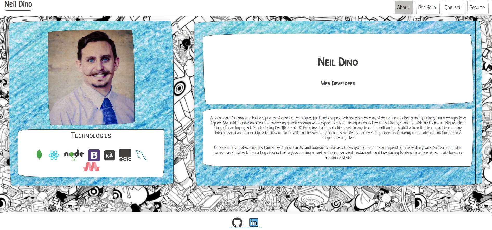

# Personal Portfolio

## Overview

This is my personal portfolio that includes my resume and project samples.  It was created as a Single Page application with React

## Purpose
For you to view and hire me!!!

## Technologies used

* Javascript
* React
* CSS
* PaperCSS framework

## Features

When the page loads my about me section is displayed.  You can see which page is current by looking at the highlighted section in the Navigation.  When a new page is clicked the application does not reload.  When portfolio is clicked 6 of my recent projects are displayed with information about each and links to their deployed page as well as the Github repository.  When contact is clicked a form is displayed to enter name, email and a message.  On the resume page, an overview of my resume is shown and a link is displayed to download my full resume.  In the footer you can click to my Linked In as well as my Github homepage.

## Usage

Navigate to it enjoy, and hopefully reach out to me for a job interview!

## Deployed application 

https://ngdino.github.io/

## Status

This is a work in progress and will be updated as I have new projects, and also with additional styling and animations.

## Contributions

I am the sole contributor on this project